# Seata 学习

> 本文主要描述 [Seata](https://github.com/seata/seata) 分布式事务的环境搭建、nacos 配置中心整合、DB模式的使用、spring-cloud 整合
>
> 作者 : [huifer ](https://github.com/huifer)
>
> 编辑时间: 2020年05月14日

## 软件列表

- seata
- nacos

## 安装服务端

- 本文使用 1.2.0 版本进行安装配置整合 , 下载地址请查看[github](https://github.com/seata/seata/releases)

  

## 配置服务端

~~~sh
# 解压编译后文件
tar -zxvf seata-server-1.2.0.tar.gz
# 查看解压内容
cd seata
ls -ls
-rw-r--r--@   1 huifer  staff    11K  5 13  2019 LICENSE
drwxr-xr-x    4 huifer  staff   128B  5 14 08:19 bin # 执行脚本
drwxr-xr-x@   9 huifer  staff   288B  4 21 14:10 conf # 配置信息
drwxr-xr-x@ 149 huifer  staff   4.7K  4 21 14:11 lib # 依赖
~~~


### mysql 配置
- 应用成功获取，接下来进行数据库(mysql)配置。由于数据库版本存在差异如果选择的mysql版本大于等于8 请下载mysql8的驱动jar包

  - 下载地址: https://mvnrepository.com/artifact/mysql/mysql-connector-java/8.0.20

    ```shell
    cd seata/lib
    wget https://repo1.maven.org/maven2/mysql/mysql-connector-java/8.0.20/mysql-connector-java-8.0.20.jar
    ```

    

- 驱动完成，接下来安装数据库, 如果存在数据库实例就可以直接执行sql脚本创建 seata 所需要的数据库

  - sql 脚本的寻找. 在 [seata 仓库](https://github.com/seata/seata/tree/develop/script) 可以看到 `script` 的脚本文件夹. 这里笔者将项目拉取到了本地给读者们看一下内部存放了什么吧。

    ```shell
    cd script
    ls -ls
    drwxr-xr-x  6 huifer  staff   192B  5 14 08:10 client
    drwxr-xr-x  9 huifer  staff   288B  5 14 08:10 config-center
    drwxr-xr-x  6 huifer  staff   192B  5 14 08:10 server
    
    # 由于我们处于服务端安装,就进入server查看
    cd server 
    ls -ls
    drwxr-xr-x  5 huifer  staff   160B  5 14 08:10 db
    drwxr-xr-x  3 huifer  staff    96B  5 14 08:10 docker-compose
    drwxr-xr-x  3 huifer  staff    96B  5 14 08:10 helm
    drwxr-xr-x  3 huifer  staff    96B  5 14 08:10 kubernetes
    # 我们需要安装的模式是db模式进入db查看
    cd db 
    ls -ls
    total 24
    8 -rw-r--r--  1 huifer  staff  1975  5 14 08:10 mysql.sql
    8 -rw-r--r--  1 huifer  staff  1864  5 14 08:10 oracle.sql
    8 -rw-r--r--  1 huifer  staff  1992  5 14 08:10 postgresql.sql
    ```

    - 目前支持 mysql、oracle、postgresql 三种数据库, 选择我们的mysql进行创建

    - sql 内容如下

      ~~~sql
      -- -------------------------------- The script used when storeMode is 'db' --------------------------------
      -- the table to store GlobalSession data
      CREATE TABLE IF NOT EXISTS `global_table`
      (
          `xid`                       VARCHAR(128) NOT NULL,
          `transaction_id`            BIGINT,
          `status`                    TINYINT      NOT NULL,
          `application_id`            VARCHAR(32),
          `transaction_service_group` VARCHAR(32),
          `transaction_name`          VARCHAR(128),
          `timeout`                   INT,
          `begin_time`                BIGINT,
          `application_data`          VARCHAR(2000),
          `gmt_create`                DATETIME,
          `gmt_modified`              DATETIME,
          PRIMARY KEY (`xid`),
          KEY `idx_gmt_modified_status` (`gmt_modified`, `status`),
          KEY `idx_transaction_id` (`transaction_id`)
      ) ENGINE = InnoDB
        DEFAULT CHARSET = utf8;
      
      -- the table to store BranchSession data
      CREATE TABLE IF NOT EXISTS `branch_table`
      (
          `branch_id`         BIGINT       NOT NULL,
          `xid`               VARCHAR(128) NOT NULL,
          `transaction_id`    BIGINT,
          `resource_group_id` VARCHAR(32),
          `resource_id`       VARCHAR(256),
          `branch_type`       VARCHAR(8),
          `status`            TINYINT,
          `client_id`         VARCHAR(64),
          `application_data`  VARCHAR(2000),
          `gmt_create`        DATETIME(6),
          `gmt_modified`      DATETIME(6),
          PRIMARY KEY (`branch_id`),
          KEY `idx_xid` (`xid`)
      ) ENGINE = InnoDB
        DEFAULT CHARSET = utf8;
      
      -- the table to store lock data
      CREATE TABLE IF NOT EXISTS `lock_table`
      (
          `row_key`        VARCHAR(128) NOT NULL,
          `xid`            VARCHAR(96),
          `transaction_id` BIGINT,
          `branch_id`      BIGINT       NOT NULL,
          `resource_id`    VARCHAR(256),
          `table_name`     VARCHAR(32),
          `pk`             VARCHAR(36),
          `gmt_create`     DATETIME,
          `gmt_modified`   DATETIME,
          PRIMARY KEY (`row_key`),
          KEY `idx_branch_id` (`branch_id`)
      ) ENGINE = InnoDB
        DEFAULT CHARSET = utf8;
      
      ~~~

      - 可以看到这个没有创建数据库我们需要先创建一个数据库在将脚本执行。数据库名称就叫 seata吧 

        ~~~sql
        CREATE DATABASE `seata` DEFAULT CHARACTER SET utf8 COLLATE utf8_general_ci;
        ~~~

        - 在数据库中创建表格

          ```mysql
          use seata;
          -- 复制找到的 /script/server/db/mysql.sql
          
          
          show tables;
          
          mysql> show tables;
          +-----------------+
          | Tables_in_seata |
          +-----------------+
          | branch_table    |
          | global_table    |
          | lock_table      |
          +-----------------+
          3 rows in set (0.01 sec)
          ```

          - 当我们执行 `show tables` 查看到三张表，此时我们对数据库的环境创建完成
            1. branch_table
            2. global_table
            3. lock_table


- mysql 环境已经完成，紧接着需要将这部分信息填充到 seata 服务端上

### seata 配置mysql 信息 开启db模式

```shell
cd seata/conf
ls -ls

total 48
0 drwxr-xr-x@ 3 huifer  staff    96  4 21 14:10 META-INF
8 -rw-r--r--@ 1 huifer  staff  1327  4 21 14:10 README-zh.md
8 -rw-r--r--@ 1 huifer  staff  1324  4 21 14:10 README.md
8 -rw-r--r--@ 1 huifer  staff  1165  4 21 14:10 file.conf
8 -rw-r--r--@ 1 huifer  staff  2929  4 21 14:10 file.conf.example
8 -rw-r--r--@ 1 huifer  staff  2152  4 21 14:10 logback.xml
8 -rw-r--r--@ 1 huifer  staff  1631  4 21 14:10 registry.conf
```

- 修改 `file.conf`，修改后如下所示, `#`为注释原有的配置信息

~~~ini

## transaction log store, only used in seata-server
store {
  ## store mode: file、db
  mode = "file"
  # mode = "db"
  ## file store property
  file {
    ## store location dir
    dir = "sessionStore"
    # branch session size , if exceeded first try compress lockkey, still exceeded throws exceptions
    maxBranchSessionSize = 16384
    # globe session size , if exceeded throws exceptions
    maxGlobalSessionSize = 512
    # file buffer size , if exceeded allocate new buffer
    fileWriteBufferCacheSize = 16384
    # when recover batch read size
    sessionReloadReadSize = 100
    # async, sync
    flushDiskMode = async
  }

  ## database store property
  db {
    ## the implement of javax.sql.DataSource, such as DruidDataSource(druid)/BasicDataSource(dbcp) etc.
    datasource = "druid"
    ## mysql/oracle/postgresql/h2/oceanbase etc.
    dbType = "mysql"
    # driverClassName = "com.mysql.jdbc.Driver"
    driverClassName = "com.mysql.cj.jdbc.Driver"
    # url = "jdbc:mysql://127.0.0.1:3306/seata"
    url = "jdbc:mysql://127.0.0.1:32832/seata"
    user = "root"
    password = "123qwe"
    minConn = 5
    maxConn = 30
    globalTable = "global_table"
    branchTable = "branch_table"
    lockTable = "lock_table"
    queryLimit = 100
    maxWait = 5000
  }
}

~~~


### nacos 配置

- 版本 ： nacos-server-1.1.3.zip
- 下载地址 ： https://github.com/alibaba/nacos/releases

- 启动命令 ： `sh bin/startup.sh -m standalone`

- 先将 nacos 启动起来 ， 在进行后续操作。

~~~
  501 11470     1   0  9:04上午 ttys005    0:15.37 /Library/Java/JavaVirtualMachines/adoptopenjdk-8.jdk/Contents/Home/bin/java -Xms512m -Xmx512m -Xmn256m -Dnacos.standalone=true -Djava.ext.dirs=/Library/Java/JavaVirtualMachines/adoptopenjdk-8.jdk/Contents/Home/jre/lib/ext:/Library/Java/JavaVirtualMachines/adoptopenjdk-8.jdk/Contents/Home/lib/ext:/Users/huifer/Desktop/learn-seata/nacos/plugins/cmdb:/Users/huifer/Desktop/learn-seata/nacos/plugins/mysql -Xloggc:/Users/huifer/Desktop/learn-seata/nacos/logs/nacos_gc.log -verbose:gc -XX:+PrintGCDetails -XX:+PrintGCDateStamps -XX:+PrintGCTimeStamps -XX:+UseGCLogFileRotation -XX:NumberOfGCLogFiles=10 -XX:GCLogFileSize=100M -Dnacos.home=/Users/huifer/Desktop/learn-seata/nacos -Dloader.path=/Users/huifer/Desktop/learn-seata/nacos/plugins/health -jar /Users/huifer/Desktop/learn-seata/nacos/target/nacos-server.jar --spring.config.location=classpath:/,classpath:/config/,file:./,file:./config/,file:/Users/huifer/Desktop/learn-seata/nacos/conf/ --logging.config=/Users/huifer/Desktop/learn-seata/nacos/conf/nacos-logback.xml --server.max-http-header-size=524288 nacos.nacos
~~~

- 访问 http://localhost:8848/nacos 
  - 账号密码都是nacos


## seata 配置注册中心

- 修改 seata 服务端的`conf/registry.conf`文件，具体修改如下

~~~ini
registry {
  # file 、nacos 、eureka、redis、zk、consul、etcd3、sofa
  # type = "file"
  type = "nacos"

  nacos {
    application = "seata-server"
    serverAddr = "localhost"
    namespace = ""
    cluster = "default"
    username = ""
    password = ""
  }
  eureka {
    serviceUrl = "http://localhost:8761/eureka"
    application = "default"
    weight = "1"
  }
  redis {
    serverAddr = "localhost:6379"
    db = 0
    password = ""
    cluster = "default"
    timeout = 0
  }
  zk {
    cluster = "default"
    serverAddr = "127.0.0.1:2181"
    sessionTimeout = 6000
    connectTimeout = 2000
    username = ""
    password = ""
  }
  consul {
    cluster = "default"
    serverAddr = "127.0.0.1:8500"
  }
  etcd3 {
    cluster = "default"
    serverAddr = "http://localhost:2379"
  }
  sofa {
    serverAddr = "127.0.0.1:9603"
    application = "default"
    region = "DEFAULT_ZONE"
    datacenter = "DefaultDataCenter"
    cluster = "default"
    group = "SEATA_GROUP"
    addressWaitTime = "3000"
  }
  file {
    name = "file.conf"
  }
}

config {
  # file、nacos 、apollo、zk、consul、etcd3
  type = "file"

  nacos {
    serverAddr = "localhost"
    namespace = ""
    group = "SEATA_GROUP"
    username = ""
    password = ""
  }
  consul {
    serverAddr = "127.0.0.1:8500"
  }
  apollo {
    appId = "seata-server"
    apolloMeta = "http://192.168.1.204:8801"
    namespace = "application"
  }
  zk {
    serverAddr = "127.0.0.1:2181"
    sessionTimeout = 6000
    connectTimeout = 2000
    username = ""
    password = ""
  }
  etcd3 {
    serverAddr = "http://localhost:2379"
  }
  file {
    name = "file.conf"
  }
}

~~~

- 这里不需要的可以删除

  ~~~ini
  registry {
    # file 、nacos 、eureka、redis、zk、consul、etcd3、sofa
    # type = "file"
    type = "nacos"
  
    nacos {
      application = "seata-server"
      serverAddr = "localhost"
      namespace = ""
      cluster = "default"
      username = ""
      password = ""
    }
    
  }
  
  config {
    # file、nacos 、apollo、zk、consul、etcd3
    type = "file"
    # type = "nacos"
  
    nacos {
      serverAddr = "localhost"
      namespace = ""
      group = "SEATA_GROUP"
      username = ""
      password = ""
    }
    
    file {
      name = "file.conf"
    }
  }
  
  ~~~

- 准备就绪 开始启动


## seata 启动

- 启动命令

  ```sh
  cd bin
  sh seata-server.sh -p 8091 -h 127.0.0.1 -m file
  ```

  日志输出

  ~~~
  OpenJDK 64-Bit Server VM warning: Cannot open file /Users/huifer/Desktop/learn-seata/seata/logs/seata_gc.log due to No such file or directory
  
  09:13:32,779 |-INFO in ch.qos.logback.classic.LoggerContext[default] - Could NOT find resource [logback-test.xml]
  09:13:32,779 |-INFO in ch.qos.logback.classic.LoggerContext[default] - Could NOT find resource [logback.groovy]
  09:13:32,780 |-INFO in ch.qos.logback.classic.LoggerContext[default] - Found resource [logback.xml] at [file:/Users/huifer/Desktop/learn-seata/seata/conf/logback.xml]
  09:13:32,781 |-WARN in ch.qos.logback.classic.LoggerContext[default] - Resource [logback.xml] occurs multiple times on the classpath.
  09:13:32,781 |-WARN in ch.qos.logback.classic.LoggerContext[default] - Resource [logback.xml] occurs at [file:/Users/huifer/Desktop/learn-seata/seata/conf/logback.xml]
  09:13:32,781 |-WARN in ch.qos.logback.classic.LoggerContext[default] - Resource [logback.xml] occurs at [jar:file:/Users/huifer/Desktop/learn-seata/seata/lib/seata-server-1.2.0.jar!/logback.xml]
  09:13:32,841 |-INFO in ch.qos.logback.classic.joran.action.ConfigurationAction - debug attribute not set
  09:13:32,845 |-INFO in ch.qos.logback.classic.joran.action.ConfigurationAction - Will scan for changes in [file:/Users/huifer/Desktop/learn-seata/seata/conf/logback.xml]
  09:13:32,845 |-INFO in ch.qos.logback.classic.joran.action.ConfigurationAction - Setting ReconfigureOnChangeTask scanning period to 1 minutes
  09:13:32,848 |-INFO in ch.qos.logback.core.joran.action.AppenderAction - About to instantiate appender of type [ch.qos.logback.core.ConsoleAppender]
  09:13:32,850 |-INFO in ch.qos.logback.core.joran.action.AppenderAction - Naming appender as [stdout]
  09:13:32,894 |-INFO in ch.qos.logback.core.joran.action.AppenderAction - About to instantiate appender of type [ch.qos.logback.core.rolling.RollingFileAppender]
  09:13:32,897 |-INFO in ch.qos.logback.core.joran.action.AppenderAction - Naming appender as [seata-default]
  09:13:32,904 |-INFO in c.q.l.core.rolling.SizeAndTimeBasedRollingPolicy@1935365522 - Archive files will be limited to [2048 MB] each.
  09:13:32,907 |-INFO in c.q.l.core.rolling.SizeAndTimeBasedRollingPolicy@1935365522 - No compression will be used
  09:13:32,908 |-INFO in c.q.l.core.rolling.SizeAndTimeBasedRollingPolicy@1935365522 - Will use the pattern /Users/huifer/logs/seata/seata-server.log.%d{yyyy-MM-dd}.%i for the active file
  09:13:32,910 |-INFO in ch.qos.logback.core.rolling.SizeAndTimeBasedFNATP@58651fd0 - The date pattern is 'yyyy-MM-dd' from file name pattern '/Users/huifer/logs/seata/seata-server.log.%d{yyyy-MM-dd}.%i'.
  09:13:32,910 |-INFO in ch.qos.logback.core.rolling.SizeAndTimeBasedFNATP@58651fd0 - Roll-over at midnight.
  09:13:32,913 |-INFO in ch.qos.logback.core.rolling.SizeAndTimeBasedFNATP@58651fd0 - Setting initial period to Wed May 13 12:46:43 CST 2020
  09:13:32,915 |-INFO in c.q.l.core.rolling.SizeAndTimeBasedRollingPolicy@1935365522 - Cleaning on start up
  09:13:32,915 |-INFO in c.q.l.core.rolling.helper.TimeBasedArchiveRemover - first clean up after appender initialization
  09:13:32,915 |-INFO in c.q.l.core.rolling.helper.TimeBasedArchiveRemover - Multiple periods, i.e. 32 periods, seem to have elapsed. This is expected at application start.
  09:13:32,915 |-INFO in ch.qos.logback.core.joran.action.NestedComplexPropertyIA - Assuming default type [ch.qos.logback.classic.encoder.PatternLayoutEncoder] for [encoder] property
  09:13:32,917 |-INFO in ch.qos.logback.core.rolling.RollingFileAppender[seata-default] - Active log file name: /Users/huifer/logs/seata/seata-server.log
  09:13:32,917 |-INFO in ch.qos.logback.core.rolling.RollingFileAppender[seata-default] - File property is set to [/Users/huifer/logs/seata/seata-server.log]
  09:13:32,918 |-INFO in ch.qos.logback.classic.joran.action.LoggerAction - Setting additivity of logger [io.seata.server.storage.file.store.FileTransactionStoreManager] to false
  09:13:32,918 |-INFO in ch.qos.logback.classic.joran.action.LevelAction - io.seata.server.storage.file.store.FileTransactionStoreManager level set to INFO
  09:13:32,918 |-INFO in ch.qos.logback.core.joran.action.AppenderRefAction - Attaching appender named [seata-default] to Logger[io.seata.server.storage.file.store.FileTransactionStoreManager]
  09:13:32,919 |-INFO in ch.qos.logback.classic.joran.action.RootLoggerAction - Setting level of ROOT logger to INFO
  09:13:32,919 |-INFO in ch.qos.logback.core.joran.action.AppenderRefAction - Attaching appender named [seata-default] to Logger[ROOT]
  09:13:32,919 |-INFO in ch.qos.logback.core.joran.action.AppenderRefAction - Attaching appender named [stdout] to Logger[ROOT]
  09:13:32,919 |-INFO in ch.qos.logback.classic.joran.action.ConfigurationAction - End of configuration.
  09:13:32,920 |-INFO in ch.qos.logback.classic.joran.JoranConfigurator@4520ebad - Registering current configuration as safe fallback point
  
  2020-05-14 09:13:33.003 INFO [main]io.seata.config.FileConfiguration.<init>:121 -The configuration file used is registry.conf
  2020-05-14 09:13:33.061 INFO [main]io.seata.config.FileConfiguration.<init>:121 -The configuration file used is file.conf
  2020-05-14 09:13:33.172 WARN [main]i.s.c.l.EnhancedServiceLoader$InnerEnhancedServiceLoader.loadFile:482 -The same extension io.seata.server.storage.file.session.FileSessionManager has already been loaded, skipped
  2020-05-14 09:13:33.172 WARN [main]i.s.c.l.EnhancedServiceLoader$InnerEnhancedServiceLoader.loadFile:482 -The same extension io.seata.server.storage.db.session.DataBaseSessionManager has already been loaded, skipped
  2020-05-14 09:13:33.237 WARN [main]i.s.c.l.EnhancedServiceLoader$InnerEnhancedServiceLoader.loadFile:482 -The same extension io.seata.server.transaction.at.ATCore has already been loaded, skipped
  2020-05-14 09:13:33.237 WARN [main]i.s.c.l.EnhancedServiceLoader$InnerEnhancedServiceLoader.loadFile:482 -The same extension io.seata.server.transaction.tcc.TccCore has already been loaded, skipped
  2020-05-14 09:13:33.237 WARN [main]i.s.c.l.EnhancedServiceLoader$InnerEnhancedServiceLoader.loadFile:482 -The same extension io.seata.server.transaction.saga.SagaCore has already been loaded, skipped
  2020-05-14 09:13:33.237 WARN [main]i.s.c.l.EnhancedServiceLoader$InnerEnhancedServiceLoader.loadFile:482 -The same extension io.seata.server.transaction.xa.XACore has already been loaded, skipped
  2020-05-14 09:13:33.241 WARN [main]i.s.c.l.EnhancedServiceLoader$InnerEnhancedServiceLoader.loadFile:482 -The same extension io.seata.server.storage.db.lock.DataBaseLockManager has already been loaded, skipped
  2020-05-14 09:13:33.241 WARN [main]i.s.c.l.EnhancedServiceLoader$InnerEnhancedServiceLoader.loadFile:482 -The same extension io.seata.server.storage.file.lock.FileLockManager has already been loaded, skipped
  2020-05-14 09:13:33.526 INFO [main]io.seata.core.rpc.netty.RpcServerBootstrap.start:155 -Server started ...
  
  ~~~

  - 进入 nacos 查看 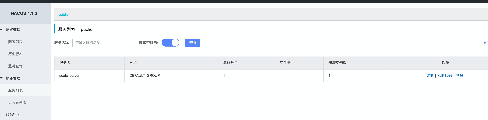
  - 可以发现已经注册上去了。 启动成功 


## 整合

### 依赖

```xml
    <!--seata 分布式事务依赖-->
        <dependency>
            <groupId>com.alibaba.cloud</groupId>
            <artifactId>spring-cloud-alibaba-seata</artifactId>
            <version>2.2.0.RELEASE</version>
            <exclusions>
                <exclusion>
                    <groupId>io.seata</groupId>
                    <artifactId>seata-spring-boot-starter</artifactId>
                </exclusion>
            </exclusions>
        </dependency>
        <dependency>
            <groupId>io.seata</groupId>
            <artifactId>seata-spring-boot-starter</artifactId>
            <version>1.2.0</version>
        </dependency>
        
```


- 示例简单说明. clinet 调用 product 项目 分别尝试 client 出现异常 product 出现异常的场景并对事务回滚进行说明


- 项目的配置信息

```yaml

spring:
  datasource:
    type: com.alibaba.druid.pool.DruidDataSource
    url: jdbc:mysql://127.0.0.1:32832/seata?useUnicode=true&characterEncoding=UTF-8&serverTimezone=UTC
    driver-class-name: com.mysql.cj.jdbc.Driver
    username: root
    password: 123qwe
    max-wait: 60000
    max-active: 100
    min-idle: 10
    initial-size: 10


mybatis:
  type-aliases-package: org.huifer.seata.product.entity
  mapper-locations: classpath:mapper/*Mapper.xml


seata:
  enabled: true
  application-id: product
  tx-service-group: my_test_tx_group
  enable-auto-data-source-proxy: true
  config:
    type: nacos
    nacos:
      serverAddr: 127.0.0.1:8848
      group: SEATA_GROUP
  registry:
    type: nacos
    nacos:
      application: seata-server
      server-addr: 127.0.0.1:8848
server:
  port: 8080
```

- 如何找到 seata 相关的配置信息？

  - 在 seata 项目中有 `script/client/spring`文件里面就是配置信息，内容不一定都要，选择需要的进行复制

  - 同样的 还有一个db 文件需要进行获取, 位于`script/client/mysql.sql`

    ```sql
    -- for AT mode you must to init this sql for you business database. the seata server not need it.
    CREATE TABLE IF NOT EXISTS `undo_log`
    (
        `branch_id`     BIGINT(20)   NOT NULL COMMENT 'branch transaction id',
        `xid`           VARCHAR(100) NOT NULL COMMENT 'global transaction id',
        `context`       VARCHAR(128) NOT NULL COMMENT 'undo_log context,such as serialization',
        `rollback_info` LONGBLOB     NOT NULL COMMENT 'rollback info',
        `log_status`    INT(11)      NOT NULL COMMENT '0:normal status,1:defense status',
        `log_created`   DATETIME(6)  NOT NULL COMMENT 'create datetime',
        `log_modified`  DATETIME(6)  NOT NULL COMMENT 'modify datetime',
        UNIQUE KEY `ux_undo_log` (`xid`, `branch_id`)
    ) ENGINE = InnoDB
      AUTO_INCREMENT = 1
      DEFAULT CHARSET = utf8 COMMENT ='AT transaction mode undo table';
    
    ```

  - 将这个文件放入目标数据库(需要支持分布式事务的数据库中)  本文演示用 seata 数据库


- 具体工程代码详见 : [seata-lean](https://github.com/huifer/seata-learn)


开始访问 ，访问出现异常

```shell
curl localhost:8081/client                                                                        
{"timestamp":"2020-05-14T01:55:54.209+0000","status":500,"error":"Internal Server Error","message":"No available service","path":"/client"}

```


```
io.seata.common.exception.FrameworkException: No available service
	at io.seata.core.rpc.netty.AbstractRpcRemotingClient.loadBalance(AbstractRpcRemotingClient.java:194) ~[seata-all-1.2.0.jar:1.2.0]
	at io.seata.core.rpc.netty.AbstractRpcRemotingClient.sendMsgWithResponse(AbstractRpcRemotingClient.java:140) ~[seata-all-1.2.0.jar:1.2.0]
	at io.seata.core.rpc.netty.AbstractRpcRemotingClient.sendMsgWithResponse(AbstractRpcRemotingClient.java:148) ~[seata-all-1.2.0.jar:1.2.0]
	at io.seata.tm.DefaultTransactionManager.syncCall(DefaultTransactionManager.java:95) ~[seata-all-1.2.0.jar:1.2.0]
	at io.seata.tm.DefaultTransactionManager.begin(DefaultTransactionManager.java:53) ~[seata-all-1.2.0.jar:1.2.0]
	at io.seata.tm.api.DefaultGlobalTransaction.begin(DefaultGlobalTransaction.java:104) ~[seata-all-1.2.0.jar:1.2.0]
	at io.seata.tm.api.TransactionalTemplate.beginTransaction(TransactionalTemplate.java:175) ~[seata-all-1.2.0.jar:1.2.0]
	at io.seata.tm.api.TransactionalTemplate.execute(TransactionalTemplate.java:98) ~[seata-all-1.2.0.jar:1.2.0]
	at io.seata.spring.annotation.GlobalTransactionalInterceptor.handleGlobalTransaction(GlobalTransactionalInterceptor.java:106) ~[seata-all-1.2.0.jar:1.2.0]
	at io.seata.spring.annotation.GlobalTransactionalInterceptor.invoke(GlobalTransactionalInterceptor.java:83) ~[seata-all-1.2.0.jar:1.2.0]
	at org.springframework.aop.framework.ReflectiveMethodInvocation.proceed(ReflectiveMethodInvocation.java:186) ~[spring-aop-5.2.6.RELEASE.jar:5.2.6.RELEASE]
	at org.springframework.aop.framework.CglibAopProxy$CglibMethodInvocation.proceed(CglibAopProxy.java:749) ~[spring-aop-5.2.6.RELEASE.jar:5.2.6.RELEASE]
	at org.springframework.aop.framework.CglibAopProxy$DynamicAdvisedInterceptor.intercept(CglibAopProxy.java:691) ~[spring-aop-5.2.6.RELEASE.jar:5.2.6.RELEASE]
	at org.huifer.seata.client.controller.ClientController$$EnhancerBySpringCGLIB$$5591e52d.client(<generated>) ~[classes/:na]
	at sun.reflect.NativeMethodAccessorImpl.invoke0(Native Method) ~[na:1.8.0_231]
	at sun.reflect.NativeMethodAccessorImpl.invoke(NativeMethodAccessorImpl.java:62) ~[na:1.8.0_231]
	at sun.reflect.DelegatingMethodAccessorImpl.invoke(DelegatingMethodAccessorImpl.java:43) ~[na:1.8.0_231]
	at java.lang.reflect.Method.invoke(Method.java:498) ~[na:1.8.0_231]
	at org.springframework.web.method.support.InvocableHandlerMethod.doInvoke(InvocableHandlerMethod.java:190) ~[spring-web-5.2.6.RELEASE.jar:5.2.6.RELEASE]
	at org.springframework.web.method.support.InvocableHandlerMethod.invokeForRequest(InvocableHandlerMethod.java:138) ~[spring-web-5.2.6.RELEASE.jar:5.2.6.RELEASE]
	at org.springframework.web.servlet.mvc.method.annotation.ServletInvocableHandlerMethod.invokeAndHandle(ServletInvocableHandlerMethod.java:105) ~[spring-webmvc-5.2.6.RELEASE.jar:5.2.6.RELEASE]
	at org.springframework.web.servlet.mvc.method.annotation.RequestMappingHandlerAdapter.invokeHandlerMethod(RequestMappingHandlerAdapter.java:879) ~[spring-webmvc-5.2.6.RELEASE.jar:5.2.6.RELEASE]
	at org.springframework.web.servlet.mvc.method.annotation.RequestMappingHandlerAdapter.handleInternal(RequestMappingHandlerAdapter.java:793) ~[spring-webmvc-5.2.6.RELEASE.jar:5.2.6.RELEASE]
	at org.springframework.web.servlet.mvc.method.AbstractHandlerMethodAdapter.handle(AbstractHandlerMethodAdapter.java:87) ~[spring-webmvc-5.2.6.RELEASE.jar:5.2.6.RELEASE]
	at org.springframework.web.servlet.DispatcherServlet.doDispatch(DispatcherServlet.java:1040) ~[spring-webmvc-5.2.6.RELEASE.jar:5.2.6.RELEASE]
	at org.springframework.web.servlet.DispatcherServlet.doService(DispatcherServlet.java:943) ~[spring-webmvc-5.2.6.RELEASE.jar:5.2.6.RELEASE]
	at org.springframework.web.servlet.FrameworkServlet.processRequest(FrameworkServlet.java:1006) ~[spring-webmvc-5.2.6.RELEASE.jar:5.2.6.RELEASE]
	at org.springframework.web.servlet.FrameworkServlet.doGet(FrameworkServlet.java:898) ~[spring-webmvc-5.2.6.RELEASE.jar:5.2.6.RELEASE]
	at javax.servlet.http.HttpServlet.service(HttpServlet.java:634) ~[tomcat-embed-core-9.0.34.jar:9.0.34]
	at org.springframework.web.servlet.FrameworkServlet.service(FrameworkServlet.java:883) ~[spring-webmvc-5.2.6.RELEASE.jar:5.2.6.RELEASE]
	at javax.servlet.http.HttpServlet.service(HttpServlet.java:741) ~[tomcat-embed-core-9.0.34.jar:9.0.34]
	at org.apache.catalina.core.ApplicationFilterChain.internalDoFilter(ApplicationFilterChain.java:231) ~[tomcat-embed-core-9.0.34.jar:9.0.34]
	at org.apache.catalina.core.ApplicationFilterChain.doFilter(ApplicationFilterChain.java:166) ~[tomcat-embed-core-9.0.34.jar:9.0.34]
	at org.apache.tomcat.websocket.server.WsFilter.doFilter(WsFilter.java:53) ~[tomcat-embed-websocket-9.0.34.jar:9.0.34]
	at org.apache.catalina.core.ApplicationFilterChain.internalDoFilter(ApplicationFilterChain.java:193) ~[tomcat-embed-core-9.0.34.jar:9.0.34]
	at org.apache.catalina.core.ApplicationFilterChain.doFilter(ApplicationFilterChain.java:166) ~[tomcat-embed-core-9.0.34.jar:9.0.34]
	at org.springframework.web.filter.RequestContextFilter.doFilterInternal(RequestContextFilter.java:100) ~[spring-web-5.2.6.RELEASE.jar:5.2.6.RELEASE]
	at org.springframework.web.filter.OncePerRequestFilter.doFilter(OncePerRequestFilter.java:119) ~[spring-web-5.2.6.RELEASE.jar:5.2.6.RELEASE]
	at org.apache.catalina.core.ApplicationFilterChain.internalDoFilter(ApplicationFilterChain.java:193) ~[tomcat-embed-core-9.0.34.jar:9.0.34]
	at org.apache.catalina.core.ApplicationFilterChain.doFilter(ApplicationFilterChain.java:166) ~[tomcat-embed-core-9.0.34.jar:9.0.34]
	at org.springframework.web.filter.FormContentFilter.doFilterInternal(FormContentFilter.java:93) ~[spring-web-5.2.6.RELEASE.jar:5.2.6.RELEASE]
	at org.springframework.web.filter.OncePerRequestFilter.doFilter(OncePerRequestFilter.java:119) ~[spring-web-5.2.6.RELEASE.jar:5.2.6.RELEASE]
	at org.apache.catalina.core.ApplicationFilterChain.internalDoFilter(ApplicationFilterChain.java:193) ~[tomcat-embed-core-9.0.34.jar:9.0.34]
	at org.apache.catalina.core.ApplicationFilterChain.doFilter(ApplicationFilterChain.java:166) ~[tomcat-embed-core-9.0.34.jar:9.0.34]
	at org.springframework.web.filter.CharacterEncodingFilter.doFilterInternal(CharacterEncodingFilter.java:201) ~[spring-web-5.2.6.RELEASE.jar:5.2.6.RELEASE]
	at org.springframework.web.filter.OncePerRequestFilter.doFilter(OncePerRequestFilter.java:119) ~[spring-web-5.2.6.RELEASE.jar:5.2.6.RELEASE]
	at org.apache.catalina.core.ApplicationFilterChain.internalDoFilter(ApplicationFilterChain.java:193) ~[tomcat-embed-core-9.0.34.jar:9.0.34]
	at org.apache.catalina.core.ApplicationFilterChain.doFilter(ApplicationFilterChain.java:166) ~[tomcat-embed-core-9.0.34.jar:9.0.34]
	at org.apache.catalina.core.StandardWrapperValve.invoke(StandardWrapperValve.java:202) ~[tomcat-embed-core-9.0.34.jar:9.0.34]
	at org.apache.catalina.core.StandardContextValve.invoke(StandardContextValve.java:96) [tomcat-embed-core-9.0.34.jar:9.0.34]
	at org.apache.catalina.authenticator.AuthenticatorBase.invoke(AuthenticatorBase.java:541) [tomcat-embed-core-9.0.34.jar:9.0.34]
	at org.apache.catalina.core.StandardHostValve.invoke(StandardHostValve.java:139) [tomcat-embed-core-9.0.34.jar:9.0.34]
	at org.apache.catalina.valves.ErrorReportValve.invoke(ErrorReportValve.java:92) [tomcat-embed-core-9.0.34.jar:9.0.34]
	at org.apache.catalina.core.StandardEngineValve.invoke(StandardEngineValve.java:74) [tomcat-embed-core-9.0.34.jar:9.0.34]
	at org.apache.catalina.connector.CoyoteAdapter.service(CoyoteAdapter.java:343) [tomcat-embed-core-9.0.34.jar:9.0.34]
	at org.apache.coyote.http11.Http11Processor.service(Http11Processor.java:373) [tomcat-embed-core-9.0.34.jar:9.0.34]
	at org.apache.coyote.AbstractProcessorLight.process(AbstractProcessorLight.java:65) [tomcat-embed-core-9.0.34.jar:9.0.34]
	at org.apache.coyote.AbstractProtocol$ConnectionHandler.process(AbstractProtocol.java:868) [tomcat-embed-core-9.0.34.jar:9.0.34]
	at org.apache.tomcat.util.net.NioEndpoint$SocketProcessor.doRun(NioEndpoint.java:1590) [tomcat-embed-core-9.0.34.jar:9.0.34]
	at org.apache.tomcat.util.net.SocketProcessorBase.run(SocketProcessorBase.java:49) [tomcat-embed-core-9.0.34.jar:9.0.34]
	at java.util.concurrent.ThreadPoolExecutor.runWorker(ThreadPoolExecutor.java:1149) [na:1.8.0_231]
	at java.util.concurrent.ThreadPoolExecutor$Worker.run(ThreadPoolExecutor.java:624) [na:1.8.0_231]
	at org.apache.tomcat.util.threads.TaskThread$WrappingRunnable.run(TaskThread.java:61) [tomcat-embed-core-9.0.34.jar:9.0.34]
	at java.lang.Thread.run(Thread.java:748) [na:1.8.0_231]

```


- 这一步是因为没有将配置信息写入到 nacos 中 需要查看https://github.com/seata/seata/tree/develop/script/config-center 

- 修改 `script/config-center/config.txt` 文件，按需修改即可

  ~~~properties
  transport.type=TCP
  transport.server=NIO
  transport.heartbeat=true
  transport.enableClientBatchSendRequest=false
  transport.threadFactory.bossThreadPrefix=NettyBoss
  transport.threadFactory.workerThreadPrefix=NettyServerNIOWorker
  transport.threadFactory.serverExecutorThreadPrefix=NettyServerBizHandler
  transport.threadFactory.shareBossWorker=false
  transport.threadFactory.clientSelectorThreadPrefix=NettyClientSelector
  transport.threadFactory.clientSelectorThreadSize=1
  transport.threadFactory.clientWorkerThreadPrefix=NettyClientWorkerThread
  transport.threadFactory.bossThreadSize=1
  transport.threadFactory.workerThreadSize=default
  transport.shutdown.wait=3
  service.vgroupMapping.my_test_tx_group=default
  service.default.grouplist=127.0.0.1:8091
  service.enableDegrade=false
  service.disableGlobalTransaction=false
  client.rm.asyncCommitBufferLimit=10000
  client.rm.lock.retryInterval=10
  client.rm.lock.retryTimes=30
  client.rm.lock.retryPolicyBranchRollbackOnConflict=true
  client.rm.reportRetryCount=5
  client.rm.tableMetaCheckEnable=false
  client.rm.sqlParserType=druid
  client.rm.reportSuccessEnable=false
  client.rm.sagaBranchRegisterEnable=false
  client.tm.commitRetryCount=5
  client.tm.rollbackRetryCount=5
  client.tm.degradeCheck=false
  client.tm.degradeCheckAllowTimes=10
  client.tm.degradeCheckPeriod=2000
  store.mode=file
  store.file.dir=file_store/data
  store.file.maxBranchSessionSize=16384
  store.file.maxGlobalSessionSize=512
  store.file.fileWriteBufferCacheSize=16384
  store.file.flushDiskMode=async
  store.file.sessionReloadReadSize=100
  store.db.datasource=druid
  store.db.dbType=mysql
  store.db.driverClassName=com.mysql.cj.jdbc.Driver
  store.db.url=jdbc:mysql://127.0.0.1:32832/seata?useUnicode=true
  store.db.user=root
  store.db.password=123qwe
  store.db.minConn=5
  store.db.maxConn=30
  store.db.globalTable=global_table
  store.db.branchTable=branch_table
  store.db.queryLimit=100
  store.db.lockTable=lock_table
  store.db.maxWait=5000
  server.recovery.committingRetryPeriod=1000
  server.recovery.asynCommittingRetryPeriod=1000
  server.recovery.rollbackingRetryPeriod=1000
  server.recovery.timeoutRetryPeriod=1000
  server.maxCommitRetryTimeout=-1
  server.maxRollbackRetryTimeout=-1
  server.rollbackRetryTimeoutUnlockEnable=false
  client.undo.dataValidation=true
  client.undo.logSerialization=jackson
  client.undo.onlyCareUpdateColumns=true
  server.undo.logSaveDays=7
  server.undo.logDeletePeriod=86400000
  client.undo.logTable=undo_log
  client.log.exceptionRate=100
  transport.serialization=seata
  transport.compressor=none
  metrics.enabled=false
  metrics.registryType=compact
  metrics.exporterList=prometheus
  metrics.exporterPrometheusPort=9898
  
  ~~~

  

- 修改完成后根据 [readme](https://github.com/seata/seata/blob/develop/script/config-center/README.md) 文档执行相关命令

 ~~~sh
sh ${SEATAPATH}/script/config-center/nacos/nacos-config.sh -h localhost -p 8848 -g SEATA_GROUP -t 5a3c7d6c-f497-4d68-a71a-2e5e3340b3ca -u username -w password
 ~~~

- 修改后的执行脚本 

  ~~~sh
  sh nacos-config.sh -h localhost -p 8848
  ~~~

  ```sh
  
  sh nacos-config.sh -h localhost -p 8848
  
  set nacosAddr=localhost:8848
  set group=SEATA_GROUP
  Set transport.type=TCP successfully
  Set transport.server=NIO successfully
  Set transport.heartbeat=true successfully
  Set transport.enableClientBatchSendRequest=false successfully
  Set transport.threadFactory.bossThreadPrefix=NettyBoss successfully
  Set transport.threadFactory.workerThreadPrefix=NettyServerNIOWorker successfully
  Set transport.threadFactory.serverExecutorThreadPrefix=NettyServerBizHandler successfully
  Set transport.threadFactory.shareBossWorker=false successfully
  Set transport.threadFactory.clientSelectorThreadPrefix=NettyClientSelector successfully
  Set transport.threadFactory.clientSelectorThreadSize=1 successfully
  Set transport.threadFactory.clientWorkerThreadPrefix=NettyClientWorkerThread successfully
  Set transport.threadFactory.bossThreadSize=1 successfully
  Set transport.threadFactory.workerThreadSize=default successfully
  Set transport.shutdown.wait=3 successfully
  Set service.vgroupMapping.my_test_tx_group=default successfully
  Set service.default.grouplist=127.0.0.1:8091 successfully
  Set service.enableDegrade=false successfully
  Set service.disableGlobalTransaction=false successfully
  Set client.rm.asyncCommitBufferLimit=10000 successfully
  Set client.rm.lock.retryInterval=10 successfully
  Set client.rm.lock.retryTimes=30 successfully
  Set client.rm.lock.retryPolicyBranchRollbackOnConflict=true successfully
  Set client.rm.reportRetryCount=5 successfully
  Set client.rm.tableMetaCheckEnable=false successfully
  Set client.rm.sqlParserType=druid successfully
  Set client.rm.reportSuccessEnable=false successfully
  Set client.rm.sagaBranchRegisterEnable=false successfully
  Set client.tm.commitRetryCount=5 successfully
  Set client.tm.rollbackRetryCount=5 successfully
  Set client.tm.degradeCheck=false successfully
  Set client.tm.degradeCheckAllowTimes=10 successfully
  Set client.tm.degradeCheckPeriod=2000 successfully
  Set store.mode=file successfully
  Set store.file.dir=file_store/data successfully
  Set store.file.maxBranchSessionSize=16384 successfully
  Set store.file.maxGlobalSessionSize=512 successfully
  Set store.file.fileWriteBufferCacheSize=16384 successfully
  Set store.file.flushDiskMode=async successfully
  Set store.file.sessionReloadReadSize=100 successfully
  Set store.db.datasource=druid successfully
  Set store.db.dbType=mysql successfully
  Set store.db.driverClassName=com.mysql.cj.jdbc.Driver successfully
  Set store.db.url=jdbc:mysql://127.0.0.1:32832/seata?useUnicode=true successfully
  Set store.db.user=root successfully
  Set store.db.password=123qwe successfully
  Set store.db.minConn=5 successfully
  Set store.db.maxConn=30 successfully
  Set store.db.globalTable=global_table successfully
  Set store.db.branchTable=branch_table successfully
  Set store.db.queryLimit=100 successfully
  Set store.db.lockTable=lock_table successfully
  Set store.db.maxWait=5000 successfully
  Set server.recovery.committingRetryPeriod=1000 successfully
  Set server.recovery.asynCommittingRetryPeriod=1000 successfully
  Set server.recovery.rollbackingRetryPeriod=1000 successfully
  Set server.recovery.timeoutRetryPeriod=1000 successfully
  Set server.maxCommitRetryTimeout=-1 successfully
  Set server.maxRollbackRetryTimeout=-1 successfully
  Set server.rollbackRetryTimeoutUnlockEnable=false successfully
  Set client.undo.dataValidation=true successfully
  Set client.undo.logSerialization=jackson successfully
  Set client.undo.onlyCareUpdateColumns=true successfully
  Set server.undo.logSaveDays=7 successfully
  Set server.undo.logDeletePeriod=86400000 successfully
  Set client.undo.logTable=undo_log successfully
  Set client.log.exceptionRate=100 successfully
  Set transport.serialization=seata successfully
  Set transport.compressor=none successfully
  Set metrics.enabled=false successfully
  Set metrics.registryType=compact successfully
  Set metrics.exporterList=prometheus successfully
  Set metrics.exporterPrometheusPort=9898 successfully
  =========================================================================
   Complete initialization parameters,  total-count:72 ,  failure-count:0
  =========================================================================
   Init nacos config finished, please start seata-server.
  ```

  

登陆 nacos 查看

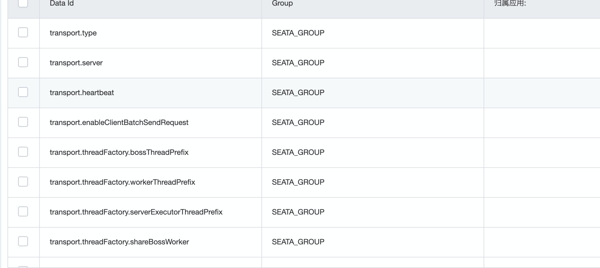

配置加载完成， 启动项目


- 调用方启动日志

```shell

  .   ____          _            __ _ _
 /\\ / ___'_ __ _ _(_)_ __  __ _ \ \ \ \
( ( )\___ | '_ | '_| | '_ \/ _` | \ \ \ \
 \\/  ___)| |_)| | | | | || (_| |  ) ) ) )
  '  |____| .__|_| |_|_| |_\__, | / / / /
 =========|_|==============|___/=/_/_/_/
 :: Spring Boot ::        (v2.2.7.RELEASE)

2020-05-14 13:53:40.344  INFO 3995 --- [           main] o.huifer.seata.client.ClientApplication  : No active profile set, falling back to default profiles: default
2020-05-14 13:53:40.797  INFO 3995 --- [           main] o.s.cloud.context.scope.GenericScope     : BeanFactory id=366eb637-65e4-3f4b-a1a1-13efe0b494d8
2020-05-14 13:53:40.849  INFO 3995 --- [           main] trationDelegate$BeanPostProcessorChecker : Bean 'org.huifer.seata.client.feign.ProductFeign' of type [org.springframework.cloud.openfeign.FeignClientFactoryBean] is not eligible for getting processed by all BeanPostProcessors (for example: not eligible for auto-proxying)
2020-05-14 13:53:40.860  INFO 3995 --- [           main] trationDelegate$BeanPostProcessorChecker : Bean 'io.seata.spring.boot.autoconfigure.SeataAutoConfiguration' of type [io.seata.spring.boot.autoconfigure.SeataAutoConfiguration$$EnhancerBySpringCGLIB$$624bc999] is not eligible for getting processed by all BeanPostProcessors (for example: not eligible for auto-proxying)
2020-05-14 13:53:40.868  INFO 3995 --- [           main] trationDelegate$BeanPostProcessorChecker : Bean 'springApplicationContextProvider' of type [io.seata.spring.boot.autoconfigure.provider.SpringApplicationContextProvider] is not eligible for getting processed by all BeanPostProcessors (for example: not eligible for auto-proxying)
2020-05-14 13:53:40.891  INFO 3995 --- [           main] trationDelegate$BeanPostProcessorChecker : Bean 'failureHandler' of type [io.seata.tm.api.DefaultFailureHandlerImpl] is not eligible for getting processed by all BeanPostProcessors (for example: not eligible for auto-proxying)
2020-05-14 13:53:40.895  INFO 3995 --- [           main] trationDelegate$BeanPostProcessorChecker : Bean 'spring.cloud.alibaba.seata-io.seata.spring.boot.autoconfigure.properties.SpringCloudAlibabaConfiguration' of type [io.seata.spring.boot.autoconfigure.properties.SpringCloudAlibabaConfiguration] is not eligible for getting processed by all BeanPostProcessors (for example: not eligible for auto-proxying)
2020-05-14 13:53:40.897  INFO 3995 --- [           main] trationDelegate$BeanPostProcessorChecker : Bean 'seata-io.seata.spring.boot.autoconfigure.properties.SeataProperties' of type [io.seata.spring.boot.autoconfigure.properties.SeataProperties] is not eligible for getting processed by all BeanPostProcessors (for example: not eligible for auto-proxying)
2020-05-14 13:53:40.897  INFO 3995 --- [           main] i.s.s.b.a.SeataAutoConfiguration         : Automatically configure Seata
2020-05-14 13:53:40.938  INFO 3995 --- [           main] io.seata.config.ConfigurationFactory     : load Configuration:FileConfiguration$$EnhancerByCGLIB$$862af1eb
2020-05-14 13:53:40.944  INFO 3995 --- [           main] trationDelegate$BeanPostProcessorChecker : Bean 'configProperties' of type [io.seata.spring.boot.autoconfigure.properties.registry.ConfigProperties] is not eligible for getting processed by all BeanPostProcessors (for example: not eligible for auto-proxying)
2020-05-14 13:53:40.954  INFO 3995 --- [           main] trationDelegate$BeanPostProcessorChecker : Bean 'configNacosProperties' of type [io.seata.spring.boot.autoconfigure.properties.registry.ConfigNacosProperties] is not eligible for getting processed by all BeanPostProcessors (for example: not eligible for auto-proxying)
2020-05-14 13:53:41.282  INFO 3995 --- [           main] i.s.s.a.GlobalTransactionScanner         : Initializing Global Transaction Clients ... 
2020-05-14 13:53:41.376  INFO 3995 --- [           main] i.s.c.r.netty.AbstractRpcRemotingClient  : RpcClientBootstrap has started
2020-05-14 13:53:41.378  INFO 3995 --- [           main] i.s.s.a.GlobalTransactionScanner         : Transaction Manager Client is initialized. applicationId[applicationName] txServiceGroup[my_test_tx_group]
2020-05-14 13:53:41.535  INFO 3995 --- [           main] io.seata.rm.datasource.AsyncWorker       : Async Commit Buffer Limit: 10000
2020-05-14 13:53:41.535  INFO 3995 --- [           main] i.s.rm.datasource.xa.ResourceManagerXA   : ResourceManagerXA init ...
2020-05-14 13:53:41.577  INFO 3995 --- [           main] i.s.c.r.netty.AbstractRpcRemotingClient  : RpcClientBootstrap has started
2020-05-14 13:53:41.577  INFO 3995 --- [           main] i.s.s.a.GlobalTransactionScanner         : Resource Manager is initialized. applicationId[applicationName] txServiceGroup[my_test_tx_group]
2020-05-14 13:53:41.577  INFO 3995 --- [           main] i.s.s.a.GlobalTransactionScanner         : Global Transaction Clients are initialized. 
2020-05-14 13:53:41.607  INFO 3995 --- [           main] trationDelegate$BeanPostProcessorChecker : Bean 'com.alibaba.cloud.seata.feign.SeataFeignClientAutoConfiguration$FeignBeanPostProcessorConfiguration' of type [com.alibaba.cloud.seata.feign.SeataFeignClientAutoConfiguration$FeignBeanPostProcessorConfiguration] is not eligible for getting processed by all BeanPostProcessors (for example: not eligible for auto-proxying)
2020-05-14 13:53:41.614  INFO 3995 --- [           main] trationDelegate$BeanPostProcessorChecker : Bean 'seataFeignObjectWrapper' of type [com.alibaba.cloud.seata.feign.SeataFeignObjectWrapper] is not eligible for getting processed by all BeanPostProcessors (for example: not eligible for auto-proxying)
2020-05-14 13:53:41.860  INFO 3995 --- [           main] o.s.b.w.embedded.tomcat.TomcatWebServer  : Tomcat initialized with port(s): 8081 (http)
2020-05-14 13:53:41.869  INFO 3995 --- [           main] o.apache.catalina.core.StandardService   : Starting service [Tomcat]
2020-05-14 13:53:41.869  INFO 3995 --- [           main] org.apache.catalina.core.StandardEngine  : Starting Servlet engine: [Apache Tomcat/9.0.34]
2020-05-14 13:53:41.956  INFO 3995 --- [           main] o.a.c.c.C.[Tomcat].[localhost].[/]       : Initializing Spring embedded WebApplicationContext
2020-05-14 13:53:41.956  INFO 3995 --- [           main] o.s.web.context.ContextLoader            : Root WebApplicationContext: initialization completed in 1595 ms
2020-05-14 13:53:42.130  INFO 3995 --- [           main] i.s.s.a.GlobalTransactionScanner         : Bean[org.huifer.seata.client.controller.ClientController] with name [clientController] would use interceptor [io.seata.spring.annotation.GlobalTransactionalInterceptor]
2020-05-14 13:53:42.173  WARN 3995 --- [           main] c.n.c.sources.URLConfigurationSource     : No URLs will be polled as dynamic configuration sources.
2020-05-14 13:53:42.174  INFO 3995 --- [           main] c.n.c.sources.URLConfigurationSource     : To enable URLs as dynamic configuration sources, define System property archaius.configurationSource.additionalUrls or make config.properties available on classpath.
2020-05-14 13:53:42.178  WARN 3995 --- [           main] c.n.c.sources.URLConfigurationSource     : No URLs will be polled as dynamic configuration sources.
2020-05-14 13:53:42.178  INFO 3995 --- [           main] c.n.c.sources.URLConfigurationSource     : To enable URLs as dynamic configuration sources, define System property archaius.configurationSource.additionalUrls or make config.properties available on classpath.
2020-05-14 13:53:42.277  INFO 3995 --- [           main] o.s.s.concurrent.ThreadPoolTaskExecutor  : Initializing ExecutorService 'applicationTaskExecutor'
2020-05-14 13:53:42.383  INFO 3995 --- [           main] o.s.s.c.ThreadPoolTaskScheduler          : Initializing ExecutorService 'Nacso-Watch-Task-Scheduler'
2020-05-14 13:53:42.563  INFO 3995 --- [           main] o.s.b.w.embedded.tomcat.TomcatWebServer  : Tomcat started on port(s): 8081 (http) with context path ''
2020-05-14 13:53:42.586  INFO 3995 --- [           main] c.a.c.n.registry.NacosServiceRegistry    : nacos registry, DEFAULT_GROUP demo-client 192.168.2.46:8081 register finished
2020-05-14 13:53:42.589  INFO 3995 --- [           main] o.huifer.seata.client.ClientApplication  : Started ClientApplication in 2.852 seconds (JVM running for 3.72)
2020-05-14 13:54:41.432  INFO 3995 --- [imeoutChecker_1] i.s.c.r.netty.NettyClientChannelManager  : will connect to 192.168.2.46:8091
2020-05-14 13:54:41.434  INFO 3995 --- [imeoutChecker_1] i.s.core.rpc.netty.NettyPoolableFactory  : NettyPool create channel to transactionRole:TMROLE,address:192.168.2.46:8091,msg:< RegisterTMRequest{applicationId='applicationName', transactionServiceGroup='my_test_tx_group'} >
2020-05-14 13:54:41.553  INFO 3995 --- [imeoutChecker_1] io.seata.core.rpc.netty.TmRpcClient      : register TM success. server version:1.2.0,channel:[id: 0x83563ff5, L:/192.168.2.46:50663 - R:/192.168.2.46:8091]
2020-05-14 13:54:41.562  INFO 3995 --- [imeoutChecker_1] i.s.core.rpc.netty.NettyPoolableFactory  : register success, cost 68 ms, version:1.2.0,role:TMROLE,channel:[id: 0x83563ff5, L:/192.168.2.46:50663 - R:/192.168.2.46:8091]
2020-05-14 13:54:41.606  INFO 3995 --- [imeoutChecker_2] i.s.c.r.netty.NettyClientChannelManager  : will connect to 192.168.2.46:8091
2020-05-14 13:54:41.607  INFO 3995 --- [imeoutChecker_2] i.s.core.rpc.netty.NettyPoolableFactory  : NettyPool create channel to transactionRole:RMROLE,address:192.168.2.46:8091,msg:< RegisterRMRequest{resourceIds='null', applicationId='applicationName', transactionServiceGroup='my_test_tx_group'} >
2020-05-14 13:54:41.614  INFO 3995 --- [imeoutChecker_2] io.seata.core.rpc.netty.RmRpcClient      : register RM success. server version:1.2.0,channel:[id: 0x5b7d2656, L:/192.168.2.46:50664 - R:/192.168.2.46:8091]
2020-05-14 13:54:41.614  INFO 3995 --- [imeoutChecker_2] i.s.core.rpc.netty.NettyPoolableFactory  : register success, cost 3 ms, version:1.2.0,role:RMROLE,channel:[id: 0x5b7d2656, L:/192.168.2.46:50664 - R:/192.168.2.46:8091]

```


- 提供方启动日志

```sh

  .   ____          _            __ _ _
 /\\ / ___'_ __ _ _(_)_ __  __ _ \ \ \ \
( ( )\___ | '_ | '_| | '_ \/ _` | \ \ \ \
 \\/  ___)| |_)| | | | | || (_| |  ) ) ) )
  '  |____| .__|_| |_|_| |_\__, | / / / /
 =========|_|==============|___/=/_/_/_/
 :: Spring Boot ::        (v2.2.7.RELEASE)

2020-05-14 13:55:26.320  INFO 4126 --- [           main] o.h.seata.product.ProductApplication     : No active profile set, falling back to default profiles: default
2020-05-14 13:55:26.838  INFO 4126 --- [           main] o.s.cloud.context.scope.GenericScope     : BeanFactory id=992c1cd2-d2f0-3b8d-a5a0-4d71abe832f0
2020-05-14 13:55:26.889  INFO 4126 --- [           main] trationDelegate$BeanPostProcessorChecker : Bean 'io.seata.spring.boot.autoconfigure.SeataAutoConfiguration' of type [io.seata.spring.boot.autoconfigure.SeataAutoConfiguration$$EnhancerBySpringCGLIB$$5f1bd427] is not eligible for getting processed by all BeanPostProcessors (for example: not eligible for auto-proxying)
2020-05-14 13:55:26.898  INFO 4126 --- [           main] trationDelegate$BeanPostProcessorChecker : Bean 'springApplicationContextProvider' of type [io.seata.spring.boot.autoconfigure.provider.SpringApplicationContextProvider] is not eligible for getting processed by all BeanPostProcessors (for example: not eligible for auto-proxying)
2020-05-14 13:55:26.923  INFO 4126 --- [           main] trationDelegate$BeanPostProcessorChecker : Bean 'failureHandler' of type [io.seata.tm.api.DefaultFailureHandlerImpl] is not eligible for getting processed by all BeanPostProcessors (for example: not eligible for auto-proxying)
2020-05-14 13:55:26.926  INFO 4126 --- [           main] trationDelegate$BeanPostProcessorChecker : Bean 'spring.cloud.alibaba.seata-io.seata.spring.boot.autoconfigure.properties.SpringCloudAlibabaConfiguration' of type [io.seata.spring.boot.autoconfigure.properties.SpringCloudAlibabaConfiguration] is not eligible for getting processed by all BeanPostProcessors (for example: not eligible for auto-proxying)
2020-05-14 13:55:26.928  INFO 4126 --- [           main] trationDelegate$BeanPostProcessorChecker : Bean 'seata-io.seata.spring.boot.autoconfigure.properties.SeataProperties' of type [io.seata.spring.boot.autoconfigure.properties.SeataProperties] is not eligible for getting processed by all BeanPostProcessors (for example: not eligible for auto-proxying)
2020-05-14 13:55:26.928  INFO 4126 --- [           main] i.s.s.b.a.SeataAutoConfiguration         : Automatically configure Seata
2020-05-14 13:55:26.961  INFO 4126 --- [           main] io.seata.config.ConfigurationFactory     : load Configuration:FileConfiguration$$EnhancerByCGLIB$$862af1eb
2020-05-14 13:55:26.966  INFO 4126 --- [           main] trationDelegate$BeanPostProcessorChecker : Bean 'configProperties' of type [io.seata.spring.boot.autoconfigure.properties.registry.ConfigProperties] is not eligible for getting processed by all BeanPostProcessors (for example: not eligible for auto-proxying)
2020-05-14 13:55:26.973  INFO 4126 --- [           main] trationDelegate$BeanPostProcessorChecker : Bean 'configNacosProperties' of type [io.seata.spring.boot.autoconfigure.properties.registry.ConfigNacosProperties] is not eligible for getting processed by all BeanPostProcessors (for example: not eligible for auto-proxying)
2020-05-14 13:55:27.198  INFO 4126 --- [           main] i.s.s.a.GlobalTransactionScanner         : Initializing Global Transaction Clients ... 
2020-05-14 13:55:27.268  INFO 4126 --- [           main] i.s.c.r.netty.AbstractRpcRemotingClient  : RpcClientBootstrap has started
2020-05-14 13:55:27.269  INFO 4126 --- [           main] i.s.s.a.GlobalTransactionScanner         : Transaction Manager Client is initialized. applicationId[client] txServiceGroup[my_test_tx_group]
2020-05-14 13:55:27.443  INFO 4126 --- [           main] io.seata.rm.datasource.AsyncWorker       : Async Commit Buffer Limit: 10000
2020-05-14 13:55:27.443  INFO 4126 --- [           main] i.s.rm.datasource.xa.ResourceManagerXA   : ResourceManagerXA init ...
2020-05-14 13:55:27.466  INFO 4126 --- [           main] i.s.c.r.netty.AbstractRpcRemotingClient  : RpcClientBootstrap has started
2020-05-14 13:55:27.466  INFO 4126 --- [           main] i.s.s.a.GlobalTransactionScanner         : Resource Manager is initialized. applicationId[client] txServiceGroup[my_test_tx_group]
2020-05-14 13:55:27.466  INFO 4126 --- [           main] i.s.s.a.GlobalTransactionScanner         : Global Transaction Clients are initialized. 
2020-05-14 13:55:27.778  INFO 4126 --- [           main] o.s.b.w.embedded.tomcat.TomcatWebServer  : Tomcat initialized with port(s): 8080 (http)
2020-05-14 13:55:27.786  INFO 4126 --- [           main] o.apache.catalina.core.StandardService   : Starting service [Tomcat]
2020-05-14 13:55:27.786  INFO 4126 --- [           main] org.apache.catalina.core.StandardEngine  : Starting Servlet engine: [Apache Tomcat/9.0.34]
2020-05-14 13:55:27.863  INFO 4126 --- [           main] o.a.c.c.C.[Tomcat].[localhost].[/]       : Initializing Spring embedded WebApplicationContext
2020-05-14 13:55:27.863  INFO 4126 --- [           main] o.s.web.context.ContextLoader            : Root WebApplicationContext: initialization completed in 1518 ms
2020-05-14 13:55:27.959  INFO 4126 --- [           main] .s.s.a.d.SeataAutoDataSourceProxyCreator : Auto proxy of [dataSource]
2020-05-14 13:55:28.180  WARN 4126 --- [           main] c.n.c.sources.URLConfigurationSource     : No URLs will be polled as dynamic configuration sources.
2020-05-14 13:55:28.180  INFO 4126 --- [           main] c.n.c.sources.URLConfigurationSource     : To enable URLs as dynamic configuration sources, define System property archaius.configurationSource.additionalUrls or make config.properties available on classpath.
2020-05-14 13:55:28.182  WARN 4126 --- [           main] c.n.c.sources.URLConfigurationSource     : No URLs will be polled as dynamic configuration sources.
2020-05-14 13:55:28.182  INFO 4126 --- [           main] c.n.c.sources.URLConfigurationSource     : To enable URLs as dynamic configuration sources, define System property archaius.configurationSource.additionalUrls or make config.properties available on classpath.
2020-05-14 13:55:28.308  INFO 4126 --- [           main] o.s.s.concurrent.ThreadPoolTaskExecutor  : Initializing ExecutorService 'applicationTaskExecutor'
2020-05-14 13:55:28.413  INFO 4126 --- [           main] o.s.s.c.ThreadPoolTaskScheduler          : Initializing ExecutorService 'Nacso-Watch-Task-Scheduler'
2020-05-14 13:55:28.508  INFO 4126 --- [           main] com.alibaba.druid.pool.DruidDataSource   : {dataSource-1} inited
2020-05-14 13:55:28.873  INFO 4126 --- [           main] i.s.c.r.netty.NettyClientChannelManager  : will connect to 192.168.2.46:8091
2020-05-14 13:55:28.874  INFO 4126 --- [           main] io.seata.core.rpc.netty.RmRpcClient      : RM will register :jdbc:mysql://127.0.0.1:32832/seata
2020-05-14 13:55:28.875  INFO 4126 --- [           main] i.s.core.rpc.netty.NettyPoolableFactory  : NettyPool create channel to transactionRole:RMROLE,address:192.168.2.46:8091,msg:< RegisterRMRequest{resourceIds='jdbc:mysql://127.0.0.1:32832/seata', applicationId='client', transactionServiceGroup='my_test_tx_group'} >
2020-05-14 13:55:28.987  INFO 4126 --- [           main] io.seata.core.rpc.netty.RmRpcClient      : register RM success. server version:1.2.0,channel:[id: 0x22ba3532, L:/192.168.2.46:50717 - R:/192.168.2.46:8091]
2020-05-14 13:55:28.995  INFO 4126 --- [           main] i.s.core.rpc.netty.NettyPoolableFactory  : register success, cost 49 ms, version:1.2.0,role:RMROLE,channel:[id: 0x22ba3532, L:/192.168.2.46:50717 - R:/192.168.2.46:8091]
2020-05-14 13:55:29.175  INFO 4126 --- [           main] o.s.b.w.embedded.tomcat.TomcatWebServer  : Tomcat started on port(s): 8080 (http) with context path ''
2020-05-14 13:55:29.182  INFO 4126 --- [           main] c.a.c.n.registry.NacosServiceRegistry    : nacos registry, DEFAULT_GROUP demo-product 192.168.2.46:8080 register finished
2020-05-14 13:55:29.186  INFO 4126 --- [           main] o.h.seata.product.ProductApplication     : Started ProductApplication in 3.566 seconds (JVM running for 4.264)

```


看到这个

```
2020-05-14 13:55:28.874  INFO 4126 --- [           main] io.seata.core.rpc.netty.RmRpcClient      : RM will register :jdbc:mysql://127.0.0.1:32832/seata

```

就可以说项目已经连接到了 seata 


## 分布式事务的测试

### 调用方出现异常


- debug 进行异常抛出 查看


在调用方打上断点

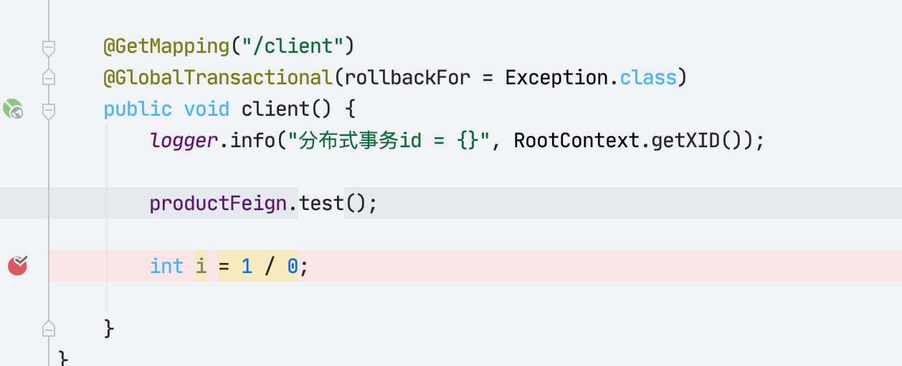

- 业务代码是修改id=1的数据

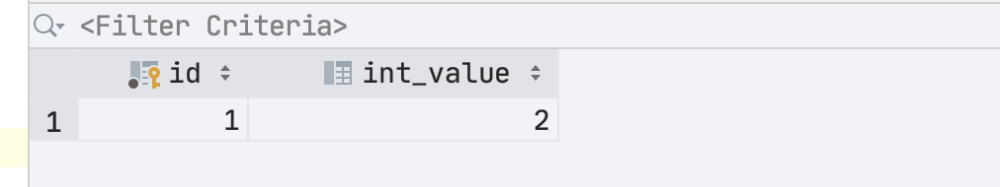


- 发起请求 `curl localhost:8081/client`

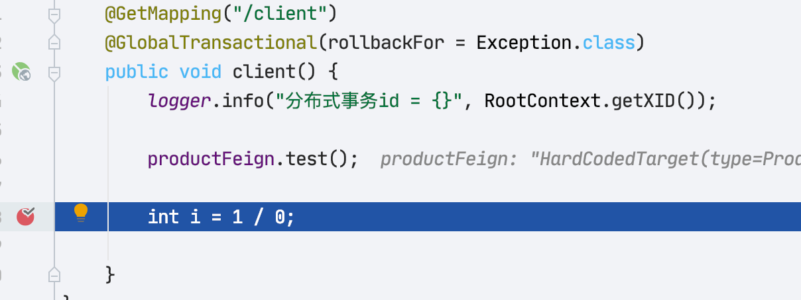

断点卡主。此时去查看数据库

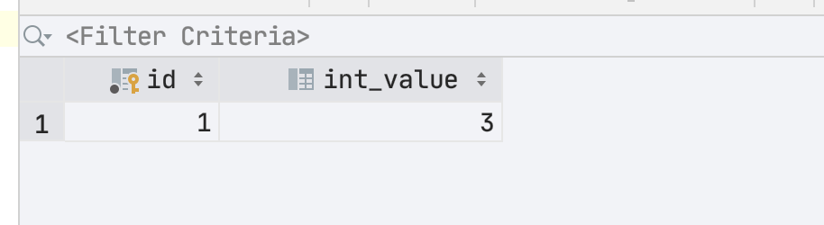

好的数据库更新了 ，继续走完断点，再刷新数据库


发现回滚了。 OK 回滚成功就说明我们的分布式事务搭建完成了


### 提供方出现异常

- 将异常放在提供方

  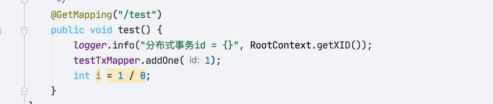

重启项目 进入测试

返回值：

```JSON
{"timestamp":"2020-05-14T06:13:02.097+0000","status":500,"error":"Internal Server Error","message":"status 500 reading ProductFeign#test()","path":"/client"}
```


### 提供方出现异常并且内部处理了

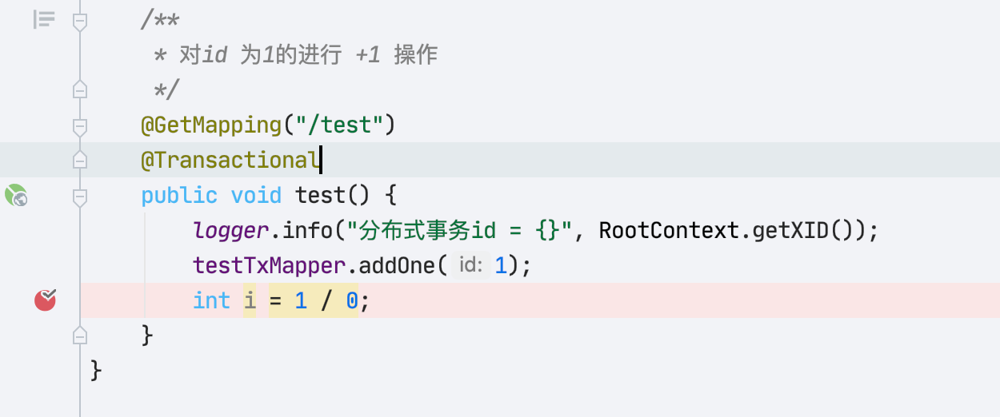

返回值

```json
{"timestamp":"2020-05-14T06:17:36.822+0000","status":500,"error":"Internal Server Error","message":"status 500 reading ProductFeign#test()","path":"/client"}
```


### 提供方的全局异常处理机制

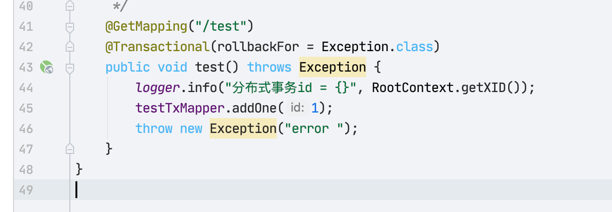

```JAVA
package org.huifer.seata.product.handler;

import org.springframework.http.ResponseEntity;
import org.springframework.web.bind.annotation.ControllerAdvice;
import org.springframework.web.bind.annotation.ExceptionHandler;
import org.springframework.web.bind.annotation.ResponseBody;

@ControllerAdvice
public class GlobalExceptionHandler {

    @ExceptionHandler(Exception.class)
    public ResponseEntity exceptionHandle(Exception e) { // 处理方法参数的异常类型
        return null;//自己需要实现的异常处理
    }

    @ExceptionHandler(RuntimeException.class)
    @ResponseBody
    public ResponseEntity handle(Throwable e) {
        return null; //自己需要实现的异常处理
    }
}
```

- 当我们添加了这段全局异常处理后这个异常会被直接作为 result 做一个返回。seata 没有办法进行回滚处理

- 返回值为空


## 事务理解

- 这里就直接贴聊天记录了 ，和 seata 项目的一个贡献者对于事务的探讨


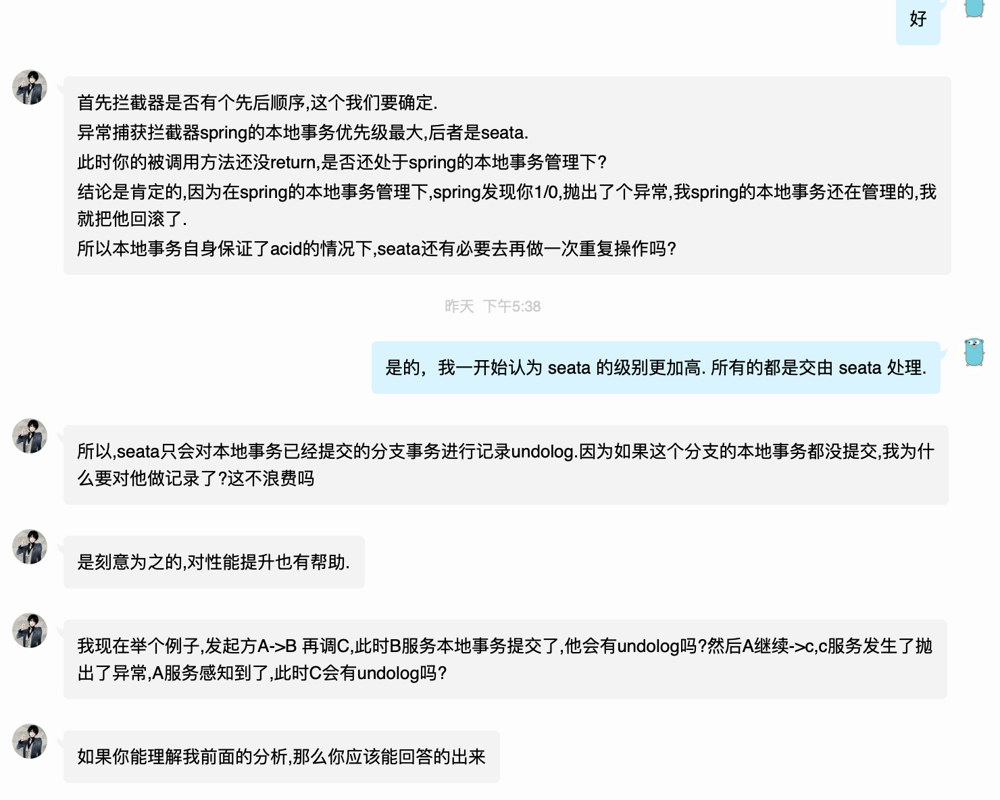

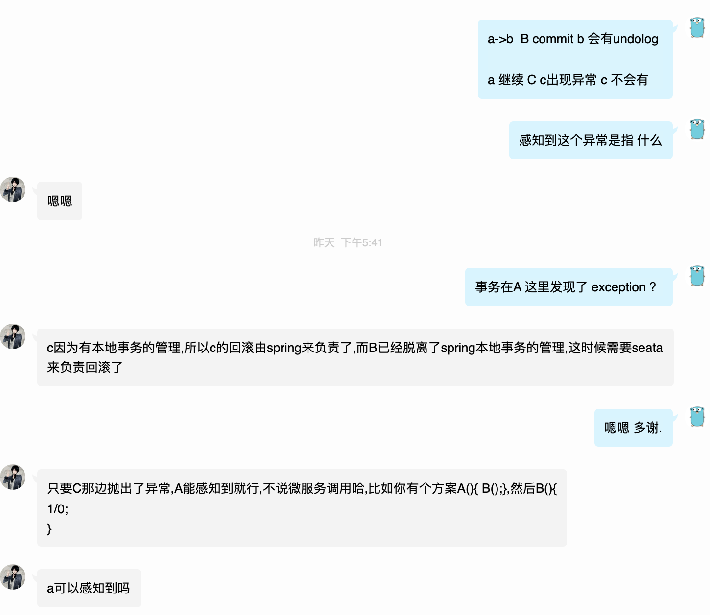

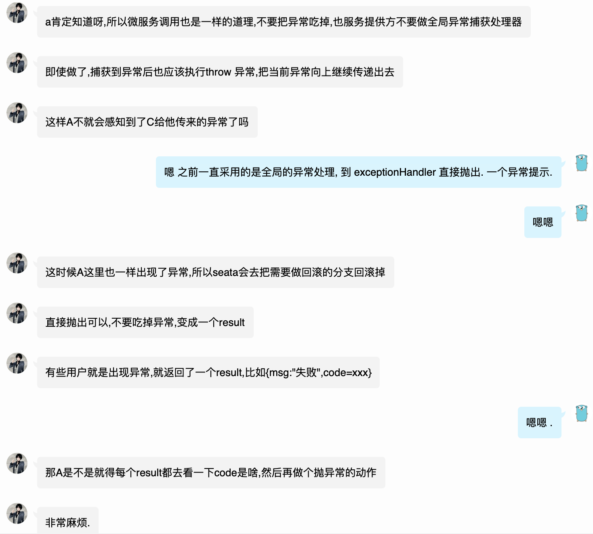


## 致谢
- 感谢 FUNKYE 这位开源贡献者的帮助。